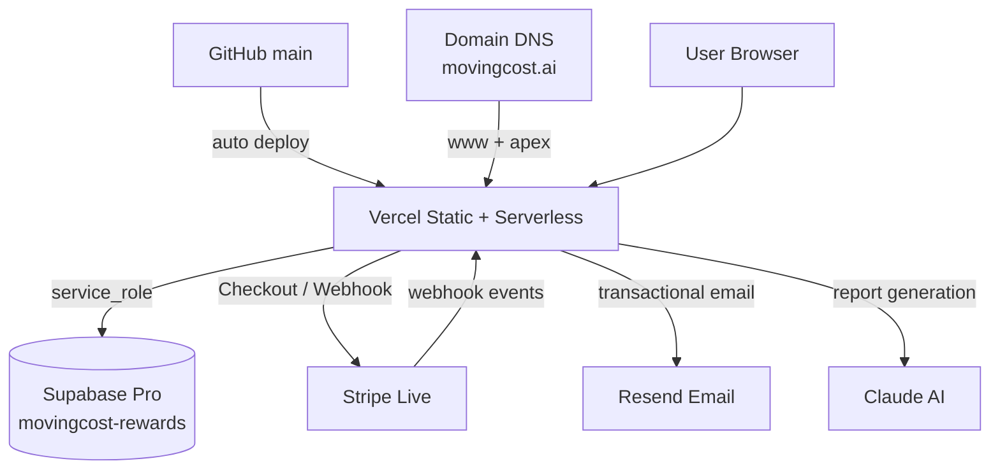

# MovingCOST.ai

# Production Infrastructure Manual

**Version 1.2**  
**Last Updated:** 2026-07-19  
**Status:** Effective (official)

This document is the single source of truth  
for the MovingCOST.ai production environment.

Do not delete or silently rewrite this manual.  
Future updates ship as new versions: **v1.2 → v1.3 → v2.0**.  
Historical file `docs/production-infrastructure-v1.0.md` remains the immutable audit baseline.

| Field | Value |
|-------|-------|
| Document | Production Infrastructure Manual v1.2 |
| Status | Effective |
| Based On | `docs/production-infrastructure-v1.1.md` + Pathways IA migration |
| Manual Date | 2026-07-19 |
| Approved By | Da Vinci / CLASSIC SPREAD INC |
| Maintainer | Da Vinci / CLASSIC SPREAD INC |
| Repository | [github.com/yunjianname2026/movingcost-ai](https://github.com/yunjianname2026/movingcost-ai) |
| Canonical URL | `https://www.movingcost.ai` |
| Governance | `/PROJECT_BOUNDARIES.md` (project constitution) |
| Docs Index | `/docs/README.md` |

> **Purpose:** Permanent operations manual for MovingCOST.ai production.  
> Future engineers should understand the entire production system within 30 minutes.  
> This is **not** an audit rewrite — all verified facts from v1.0 are preserved.

---

## Executive Summary — 生产清单

| Item | Status | Notes |
|------|--------|-------|
| ✓ Vercel | **Live** | `okayus/movingcost-ai` · Production Ready · `iad1` |
| ✓ Supabase Pro | **Live** | Project `movingcost-rewards` · main · PRODUCTION（已由 Da Vinci 确认升级 Pro） |
| ✓ Stripe Live | **Live** | Checkout + Webhook 已配置；密钥存于 Vercel（加密，需 Dashboard 确认 Live 模式） |
| ✓ Resend | **Live** | `reports@movingcost.ai` / `support@movingcost.ai` · DKIM/SPF 已配置 |
| ✓ Domain | **Live** | `movingcost.ai` · Vercel 托管 |
| ✓ DNS | **Live** | Apex → Vercel · `www` 为 canonical · MX → Google |
| ✓ Environment Variables | **Mostly aligned** | 核心链路齐全；2 个可选/管理变量未在 Vercel 列出 |
| ✓ Backup Strategy | **Pro tier** | Supabase Pro 自动备份 + PITR；无额外 off-site 自动化 |
| ⚠ Monitoring | **Partial** | GA4 + 各平台 Dashboard；无统一告警 / APM |

**Production chain（主链路）:**

```
GitHub main
    ↓ auto deploy
Vercel (static + serverless, iad1)
    ↓ env: SUPABASE_URL + SERVICE_ROLE_KEY
Supabase movingcost-rewards (Postgres, service_role only)
    ↓
Resend (transactional email)  +  Stripe (payments)  +  Claude (report generation)
```


---

## Pathways Architecture (v1.2)

MovingCOST Pathways is the top-level information architecture for international students and early-career professionals.

### URL map

| Role | Production URL | File |
|------|----------------|------|
| Student Hub | `/pathways` | `pathways/index.html` |
| City Opportunity | `/pathways/opportunity` | `pathways/opportunity.html` |
| Career & City Life | `/pathways/career` | `pathways/career.html` |
| Startup Lab | `/pathways/startup-lab` | `pathways/startup-lab/index.html` |
| Program Handbook | `/pathways/startup-lab/handbook` | `pathways/startup-lab/handbook.html` |
| Apply | `/pathways/startup-lab/apply` | `pathways/startup-lab/apply.html` |

### Legacy redirects (`vercel.json` — exact paths only)

| Source | Destination | Type |
|--------|-------------|------|
| `/startup-lab` | `/pathways/startup-lab` | permanent (301) |
| `/startup-lab-handbook` | `/pathways/startup-lab/handbook` | permanent (301) |
| `/startup-lab-apply` | `/pathways/startup-lab/apply` | permanent (301) |

**Do not** redirect `/api/startup-lab-apply`.  
**Do not** add wildcard or auth/Magic Link redirects.

### Form preservation

| Item | Value |
|------|-------|
| API | `POST /api/startup-lab-apply` (unchanged) |
| Table | `startup_lab_applications` (unchanged) |
| Client `source_page` | `/pathways/startup-lab/apply` |

### Navigation coverage

Pathways desktop dropdown + mobile PATHWAYS group on:

`index.html`, `about.html`, `services.html`, `contact.html`, `privacy.html`, `terms.html`, `blog/index.html`, and all six Pathways pages.

Individual blog articles are **not** in scope (no Pathways nav).

### Rollback

1. Revert `main` to pre-Pathways commit, **or** Vercel Instant Rollback to prior production deployment.  
2. Remove the three `redirects` entries from `vercel.json` if restoring root Startup Lab HTML as primary.  
3. Legacy root files `startup-lab.html`, `startup-lab-handbook.html`, `startup-lab-apply.html` may still exist as rollback assets until intentionally deleted in a later cleanup.


## 1. Project Overview

MovingCOST.ai is a production web product for relocation planning, city-personality assessment, membership, and paid AI reports.

**Production stack**

| Layer | Technology |
|-------|------------|
| Frontend | Static HTML / CSS / JS (no framework) |
| Source control | GitHub `yunjianname2026/movingcost-ai` |
| Hosting / serverless | Vercel (`okayus/movingcost-ai`, region `iad1`) |
| Database | Supabase Pro — project `movingcost-rewards` |
| Payments | Stripe Live — Checkout Session + webhook |
| Email | Resend — `reports@movingcost.ai` / `support@movingcost.ai` |
| AI reports | Anthropic Claude (`claude-sonnet-4-6`) |
| Analytics | Google Analytics 4 (`G-22NEPD9J8R`) |
| Canonical domain | `https://www.movingcost.ai` |

**How services work together**

Developers push to GitHub `main`. Vercel auto-deploys static pages and `/api/*` serverless functions. Browser traffic never talks to Supabase directly: APIs use `SUPABASE_SERVICE_ROLE_KEY` against `movingcost-rewards`. Paid reports flow through Stripe Checkout and `/api/webhook`, then Claude generation and Resend delivery via `/api/send-report`. Membership (Magic Link, welcome email, points) also runs through Vercel APIs + Supabase + Resend. Domain/DNS point the public site at Vercel; email DNS (SPF/DKIM/DMARC) supports Resend deliverability.

Governance for code changes remains `/PROJECT_BOUNDARIES.md` (three closed systems: Report Engine, EarthSoul Engine, Member & Rewards Engine).

---

## 2. Architecture Diagram

### Mermaid



### Plain text

```
                    ┌─────────────────────┐
                    │   GitHub (main)     │
                    └──────────┬──────────┘
                               │ auto deploy
                               ▼
┌──────────┐   DNS    ┌─────────────────────┐
│ Domain / │ ───────► │ Vercel (iad1)       │
│ DNS      │          │ static + /api/*     │
└──────────┘          └──────────┬──────────┘
                               │
        ┌──────────────────────┼──────────────────────┐
        │                      │                      │
        ▼                      ▼                      ▼
┌───────────────┐    ┌─────────────────┐    ┌─────────────────┐
│ Supabase Pro  │    │ Stripe Live     │    │ Resend          │
│ movingcost-   │    │ Checkout +      │    │ reports@ /      │
│ rewards       │    │ /api/webhook    │    │ support@        │
└───────────────┘    └─────────────────┘    └─────────────────┘
                               │
                               ▼
                     ┌─────────────────┐
                     │ Claude          │
                     │ (send-report /  │
                     │  generate)      │
                     └─────────────────┘
```

---

## 3. Production Services

| Service | Purpose | Status | Notes |
|---------|---------|--------|-------|
| GitHub | Source of truth; `main` triggers production deploy | Live | [yunjianname2026/movingcost-ai](https://github.com/yunjianname2026/movingcost-ai) |
| Vercel | Hosting + serverless APIs | Live | `okayus/movingcost-ai` · `prj_4FjiCTMGyi91vFODTJlDAsJZWhmf` · `iad1` |
| Supabase Pro | Postgres for users, tokens, rewards, orders | Live | Project `movingcost-rewards` · server-only via `service_role` |
| Stripe Live | $9.90 Checkout + payment webhook | Live | Endpoint `https://www.movingcost.ai/api/webhook` |
| Resend | Magic Link, welcome, payment confirm, full report email | Live | From `reports@movingcost.ai` |
| Domain | Public brand domain | Live | `movingcost.ai` |
| DNS | Apex/www → Vercel; MX → Google; SPF/DKIM/DMARC for email | Live | Nameservers: `ns09` / `ns10.domaincontrol.com` |

---

## 4. Environment Variables

**Rule: never commit or paste secret values.**  
Secrets live encrypted in Vercel. Below documents **names, purpose, used-by, and environment only**.

### 4.1 Core production variables

#### `SUPABASE_URL`

| Field | Value |
|-------|-------|
| Purpose | Production database connection URL |
| Used by | All DB APIs (`user`, `magic-link`, `verify-token`, `rewards`, `referral`, `webhook`, `send-report`, `resend-report`, `startup-lab-apply`) |
| Environment | **Vercel Production only** (Preview intentionally omitted) |

#### `SUPABASE_SERVICE_ROLE_KEY`

| Field | Value |
|-------|-------|
| Purpose | Server-side Supabase access (bypasses RLS); frontend never uses this |
| Used by | Same DB APIs as above |
| Environment | Vercel Production + Preview |

#### `STRIPE_SECRET_KEY`

| Field | Value |
|-------|-------|
| Purpose | Create Checkout Sessions; Stripe SDK server calls |
| Used by | `api/create-checkout.js`, `api/webhook.js` |
| Environment | Vercel Production + Preview |

#### `STRIPE_WEBHOOK_SECRET`

| Field | Value |
|-------|-------|
| Purpose | Verify Stripe webhook signatures |
| Used by | `api/webhook.js` |
| Environment | Vercel Production + Preview |

#### `RESEND_API_KEY`

| Field | Value |
|-------|-------|
| Purpose | Send transactional email |
| Used by | `api/magic-link.js`, `api/user.js`, `api/webhook.js`, `api/send-report.js`, `api/resend-report.js` |
| Environment | Vercel Production + Preview |

### 4.2 Additional verified variables (from v1.0 audit)

| Variable | Purpose | Used by | Environment |
|----------|---------|---------|-------------|
| `BASE_URL` | Magic Link base URL | `api/magic-link.js` | Preview + Production |
| `CLAUDE_API_KEY` | Anthropic report / preview generation | `api/generate.js`, `api/send-report.js` | Production + Preview |
| `WX_APP_ID` | WeChat share signature | `api/wx-signature.js` | Production only |
| `WX_APP_SECRET` | WeChat access token | `api/wx-signature.js` | Production only |

### 4.3 Referenced in code but NOT in Vercel env list (v1.0)

| Variable | Used by | Impact if missing |
|----------|---------|-------------------|
| `ADMIN_SECRET` | `rewards.js` `admin-adjust` | Admin 手动调积分返回 401 |
| `IP_HASH_SALT` | `startup-lab-apply.js` | IP 哈希跳过（非阻断） |
| `STARTUP_LAB_ALLOWED_ORIGINS` | `startup-lab-apply.js` | 可选；默认仅 production origins |
| `ANTHROPIC_MODEL` | `generate.js`, `send-report.js` | 可选；默认 `claude-sonnet-4-6` |

### 4.4 Cross-platform matrix (preserved from v1.0)

| Variable | Vercel Prod | Vercel Preview | Supabase | Resend | Stripe | Used In Production Flow |
|----------|-------------|----------------|----------|--------|--------|-------------------------|
| `SUPABASE_URL` | ✅ Prod only | ❌ | ✅ source | — | — | All member/DB APIs |
| `SUPABASE_SERVICE_ROLE_KEY` | ✅ | ✅ | ✅ source | — | — | All member/DB APIs |
| `RESEND_API_KEY` | ✅ | ✅ | — | ✅ source | — | Email delivery |
| `STRIPE_SECRET_KEY` | ✅ | ✅ | — | — | ✅ source | Checkout + webhook |
| `STRIPE_WEBHOOK_SECRET` | ✅ | ✅ | — | — | ✅ source | Webhook verify |
| `CLAUDE_API_KEY` | ✅ | ✅ | — | — | — | Report generation |
| `BASE_URL` | ✅ | ✅ | — | — | — | Magic Link URLs |
| `WX_APP_ID` / `WX_APP_SECRET` | ✅ Prod only | ❌ | — | — | — | WeChat share signature |
| `ADMIN_SECRET` | ❌ not listed | ❌ | — | — | — | Admin-only (optional) |
| `IP_HASH_SALT` | ❌ not listed | ❌ | — | — | — | Startup Lab (optional) |

**Consistency verdict:** Core revenue + auth + email chain is **aligned**. Preview is intentionally isolated from production Supabase URL.

---

## 5. Production Boundaries

Changes fall into three categories. When in doubt, follow `/PROJECT_BOUNDARIES.md` and wait for Da Vinci approval.

### Safe to Modify

Content and marketing surfaces that do **not** touch payments, auth, or database contracts (still use branch/PR discipline):

- Landing pages
- HTML content pages
- Page-local CSS (not shared infrastructure without review)
- Blog articles and templates (content)
- Images / static assets

### Review Required

Product-critical UI and APIs. Explicit review before deployment:

| Area | Examples |
|------|----------|
| Planner / checkout entry | `planner.html` |
| Sample report funnel | `sample-report.html` |
| Member / user APIs | `api/user.js` |
| Auth email | `api/magic-link.js` |
| Payment webhook | `api/webhook.js` |
| Paid report engine | `api/send-report.js` |
| Related high-impact APIs | `api/create-checkout.js`, `api/verify-token.js`, `api/rewards.js`, `api/resend-report.js` |

Also review-required (shared / high blast radius): `vercel.json`, `package.json`, `global.css` — see constitution.

### Critical Infrastructure

**Do not change without explicit written approval.** Wrong changes can break production revenue, login, or data:

- Stripe secrets (`STRIPE_SECRET_KEY`)
- Webhook secrets (`STRIPE_WEBHOOK_SECRET`)
- Supabase Service Role key
- Database schema / RLS / SQL on production
- Magic token system (`magic_tokens`, Magic Link flow)
- Production DNS / domain / nameservers
- `SUPABASE_URL` target project
- Adding `redirects` to `vercel.json` (known localStorage cross-domain risk)

---

## 6. Deployment Checklist

Use before and after any production-facing merge to `main`.

### Pre-deploy

- [ ] Git status clean (or only intentional files staged)
- [ ] Branch verified against approved whitelist
- [ ] Diff reviewed; no secrets in commit
- [ ] Merge completed per `/PROJECT_BOUNDARIES.md` path
- [ ] Push `main` (or approved release path)

### Post-deploy

- [ ] Vercel deployment status **Production Ready**
- [ ] Canonical site loads: `https://www.movingcost.ai`
- [ ] Planner tested (`/planner`)
- [ ] Payment path tested (Checkout → thank-you; or approved test purchase)
- [ ] Report email tested (paid report delivery via Resend)
- [ ] Welcome email tested (new user / bind-email path as applicable)
- [ ] Magic Login tested (`/login` → email → `/verify` → member)
- [ ] Dashboard tested (`/member`)
- [ ] For API changes: check Vercel Function logs
- [ ] For payment changes: Stripe Dashboard → webhook delivery
- [ ] For email changes: Resend Dashboard → delivery logs

### Never without approval (preserved from v1.0)

- Modify `vercel.json` `redirects`
- Change `SUPABASE_URL` target project
- Rotate Stripe webhook secret without updating Vercel
- Execute Supabase Phase 2 Batch 2/3 SQL (paused as of 2026-06-17)
- Commit secrets to repository

---

## 7. Backup Strategy

*(Preserved and organized from v1.0 — no new backup systems invented.)*

### 7.1 Supabase Pro (primary)

| Capability | Pro Tier | Status |
|------------|----------|--------|
| Daily automatic backups | Included | ✅ Assumed active post-upgrade (confirm in Dashboard) |
| Point-in-Time Recovery (PITR) | Included (Pro) | ✅ Available — retention per Supabase plan settings |
| Database export / manual recovery | Dashboard | ✅ Operator can export / restore via Supabase UI |

**Operator checklist:**

1. Supabase Dashboard → Project Settings → **confirm plan = Pro**
2. Database → Backups → verify latest backup timestamp
3. Confirm PITR window meets business RPO
4. Manual recovery: use Supabase Dashboard backup / PITR tools — do not invent custom restore scripts in this manual

### 7.2 Application-layer data

| Data | Storage | Backup |
|------|---------|--------|
| User profiles, points, tokens | Supabase | Covered by Supabase backups |
| Report content ($9.90) | **Email only** (Resend delivery) | User inbox = de facto copy; no DB archive of full report body |
| Payment records | Stripe Dashboard | Stripe retention + exports |
| Sent email logs | Resend Dashboard | Retention per Resend settings (verify in Dashboard) |
| Source code | GitHub `main` | Git history + Vercel deployment history |

### 7.3 Gaps (from v1.0)

- No documented off-site Supabase backup export schedule
- No automated `report_orders` → cold storage pipeline
- No infrastructure-as-code for Supabase schema (migrations live in SQL Editor / manual)

---

## 8. Disaster Recovery

**Rule:** Do not invent recovery procedures. First action is always **check the correct dashboard**, then use that platform’s documented tools.

| Scenario | Check first | Then | Notes (facts only) |
|----------|-------------|------|---------------------|
| Vercel deployment failure | **Vercel Dashboard** → Deployments | Build / Function logs; prior Ready deployment | Source is GitHub `main`; redeploy from last good commit only with approval |
| Supabase unavailable | **Supabase Dashboard** → `movingcost-rewards` | Project status, logs, advisors | App is server-only via Vercel; frontend has no direct DB URL |
| Stripe webhook failure | **Stripe Dashboard** → Developers → Webhooks / Events | Delivery attempts to `https://www.movingcost.ai/api/webhook` | Also check Vercel Function logs for `/api/webhook` |
| Resend outage | **Resend Dashboard** | Domain status, delivery / bounce logs | Affects Magic Link, welcome, confirm, report emails |
| Domain / DNS issue | **DNS / registrar** (nameservers `ns09`/`ns10.domaincontrol.com`) + **Vercel Domains** | A/CNAME for apex/www; MX/SPF/DKIM if email broken | Canonical host is `www.movingcost.ai` |

Cross-cutting: for any API symptom, also open **Vercel Function Logs** for the related `/api/*` route.

---

## 9. Monitoring

### 9.1 Current monitoring (verified)

| Layer | Tool | Coverage |
|-------|------|----------|
| Web analytics | **Google Analytics 4** (`G-22NEPD9J8R`) via `assets/tracking.js` | Page views, CTA clicks, UTM capture |
| Deployment | **Vercel Dashboard** | Build status, function logs, edge cache |
| Database | **Supabase Dashboard** | Query performance, advisors, logs |
| Email | **Resend Dashboard** | Delivery, bounces, domain health |
| Payments | **Stripe Dashboard** | Payments, disputes, webhook delivery log |
| API errors | Vercel Function Logs | Per-invocation `console.log` / `console.error` |

### 9.2 What does NOT exist today (from v1.0)

| Gap | Risk |
|-----|------|
| No Sentry / error tracking | Silent API failures may go unnoticed |
| No uptime monitor | Site outage not externally alerted |
| No centralized log aggregation | Cross-platform incident correlation is manual |
| No Stripe webhook failure auto-alert | Missed webhooks require manual Dashboard check |
| No Supabase connection pool / latency alerts | DB issues discovered reactively |

### 9.3 Future Improvements *(recommendations only — not installed)*

| Recommendation | Status |
|----------------|--------|
| **Sentry** (or equivalent error tracking) | Future only |
| **Better Stack** (logs / uptime) | Future only |
| **UptimeRobot** (or similar external uptime) | Future only |
| Stripe webhook delivery email alerts | Future / enable in Stripe if not on |
| Resend bounce/complaint notifications | Future / confirm in Resend |
| Weekly Supabase backup timestamp verification | Process recommendation |

---

## 10. Production Timeline

| Version | Scope | Status |
|---------|-------|--------|
| **v1.0** | Planner · Member · Report Engine · EarthSoul | Production |
| **v1.1** | Startup Lab · Email system hardening (Resend flows) · Production Infrastructure Manual | Production / this document |
| **v1.2** | *(placeholder)* | — |
| **v1.3** | *(placeholder)* | — |
| **v2.0** | *(placeholder)* | — |

Product milestones reflected in production (non-exhaustive): static site + APIs on Vercel; Supabase `movingcost-rewards`; Stripe $9.90 report path; Magic Link + welcome email; EarthSoul quiz + points; Startup Lab apply API; infrastructure audit (2026-07-11) → this manual (2026-07-13).

---

## 11. Quick Recovery Guide

Keep this page bookmarked for first response.

### Website unavailable

```
Website unavailable
        ↓
   Check Vercel
        ↓
   Deployments (Ready?)
        ↓
   Function / Build Logs
        ↓
   Domain aliases (www / apex)
```

### Member login failure

```
Member login failure
        ↓
   Check Supabase (movingcost-rewards)
        ↓
   Auth-related tables (magic_tokens / users)
        ↓
   Vercel logs: /api/magic-link , /api/verify-token
        ↓
   Resend (Magic Link email delivery)
```

### Payment issue

```
Payment issue
        ↓
   Check Stripe Dashboard
        ↓
   Events / Payments
        ↓
   Webhook delivery → /api/webhook
        ↓
   Vercel logs: create-checkout + webhook
```

### Report email missing

```
Report email missing
        ↓
   Stripe payment succeeded?
        ↓
   thank-you → /api/send-report
        ↓
   Vercel Function logs (send-report)
        ↓
   Resend delivery logs
        ↓
   Optional: report_orders in Supabase + /api/resend-report
```

### Email (welcome / Magic Link) missing

```
Email missing
        ↓
   Resend Dashboard
        ↓
   Domain DNS (SPF / DKIM / DMARC)
        ↓
   Vercel logs for magic-link / user
```

---

## 12. Change Log

### 12.1 Manual versions

| Version | Date | Summary |
|---------|------|---------|
| v1.0 | 2026-07-11 | Initial infrastructure audit across Vercel, Supabase Pro, Resend, Stripe. |
| v1.1 | 2026-07-13 | Converted audit into official Production Infrastructure Manual. Added architecture, deployment checklist, disaster recovery, monitoring, timeline, quick recovery, business-critical flows, AI collaboration rules, and future roadmap. Preserved all v1.0 verified facts. Same-day amendment: mandatory SSOT read order + major-module documentation duty (§14.0 / §14.5); docs index + Cursor rule enforcement. |
| v1.2 | 2026-07-19 | Pathways IA: `/pathways` hub, City Opportunity, Career & City Life; Startup Lab migrated under `/pathways/startup-lab/*`; three exact legacy 301 redirects; nav Pathways dropdown; apply `source_page` update; sitemap. |

### 12.2 Product history (project milestones)

| Period | Milestone |
|--------|-----------|
| 2026-07 | Report Engine 封板 |
| 2026-07 | Member System 封板 |
| 2026-07 | Sample Report 上线 |
| 2026-07 | Welcome Email / Magic Login 邮件统一；Member 闭环打通 |
| 2026-07 | `main` 与 `dev` 同步；Supabase 升级 Pro |
| 2026-07 | Startup Lab Beta（apply flow live） |
| 2026-07 | Production Infrastructure Manual v1.1 Effective (SSOT) |
| 2026-07 | Pathways IA live (Student Hub / Opportunity / Career / Startup Lab nested URLs) |
| 2026-07 | Production Infrastructure Manual v1.2 Effective |
| Future | Continue in Manual v1.3+ when major modules ship |

---

## 13. Business Critical User Flows

Product architecture — **which loops are already live in production**.  
Do not casually break these. Any change touching related files requires explicit review (see §5).

| Flow | Status | Related Files / Surfaces |
|------|--------|--------------------------|
| Planner → Stripe Checkout → thank-you → Report Email | ✅ Production | `planner.html`, `api/create-checkout.js`, `api/webhook.js`, `thank-you.html`, `api/send-report.js`, Resend |
| Payment Link fallback (Checkout API failure) | ✅ Production (degraded path) | `planner.html` → Stripe Payment Link `buy.stripe.com/aFa6oG51x1KUgXT0C2cfK00` |
| Report resend (7-day window) | ✅ Production | `api/resend-report.js`, `report_orders`, Resend |
| Member Registration → Welcome Email | ✅ Production | `api/user.js` (create / bind-email), Resend |
| Magic Login → Verify → Member Center | ✅ Production | `login.html`, `api/magic-link.js`, `api/verify-token.js`, `verify.html`, `member.html`, Supabase `magic_tokens` / `users` |
| EarthSoul Quiz → Points → Member Center | ✅ Production | `earthsoul.html`, `api/user.js`, `api/rewards.js`, `member.html` |
| Sample Report → Paid Report funnel | ✅ Production | `sample-report.html` → Planner / Checkout path |
| Startup Lab application submit | ✅ Production | `pathways/startup-lab/apply.html` (legacy `/startup-lab-apply` → 301), `api/startup-lab-apply.js`, Supabase `startup_lab_applications` |
| Pathways Student Hub | ✅ Production | `pathways/index.html` |
| City Opportunity (Coming Soon) | ✅ Production (page live; tool Coming Soon) | `pathways/opportunity.html` |
| Career & City Life (Coming Soon) | ✅ Production (page live; tool Coming Soon) | `pathways/career.html` |

### Not production-wired (do not assume)

| Flow | Status | Notes |
|------|--------|-------|
| Friend purchase → referral reward (`friend_purchase_completed`) | ❌ Not wired | Defined in rewards config; webhook does not auto-complete this path (v1.0 / Phase 1 audit) |
| Full report body stored in Supabase | ❌ Not stored | Report body is email-delivered only |

### Three closed systems (constitution)

| System | Core surfaces |
|--------|----------------|
| Report Engine | `planner.html`, `thank-you.html`, `api/generate.js`, `api/send-report.js`, `api/create-checkout.js`, `api/webhook.js` |
| EarthSoul Engine | `earthsoul.html`, rewards actions for quiz/share/download |
| Member & Rewards Engine | `login.html`, `verify.html`, `welcome.html`, `member.html`, `api/user.js`, `api/magic-link.js`, `api/verify-token.js`, `api/rewards.js`, `api/referral.js` |

---

## 14. AI Collaboration Rules

**MovingCOST Engineering Constitution (for all AI engineers)**

Applies to Cursor, Claude, ChatGPT, Grok, Codex, and any other AI or human collaborator.  
These rules reinforce `/PROJECT_BOUNDARIES.md`. If this section conflicts with the constitution, **follow `PROJECT_BOUNDARIES.md`**.

### 14.0 Mandatory pre-task read order (SSOT gate)

Before **any** new coding task:

```
Start any new task
        ↓
docs/README.md
        ↓
Production Infrastructure Manual (this document — SSOT)
        ↓
PROJECT_BOUNDARIES.md
        ↓
Propose plan → Da Vinci approval → begin coding
```

**If these three documents have not been read for the current task, do not modify code.**

This workflow is also enforced by `.cursor/rules/project-boundaries.mdc` for Cursor agents.

### 14.1 Engineering Rules

All AI engineers must obey:

- Never rewrite working production code.
- Always modify the smallest possible scope.
- Preserve existing UI systems.
- Avoid introducing new visual languages.
- Prefer extending existing components over creating new ones.
- Never invent infrastructure, secrets, URLs, or “helpful” drive-by refactors.
- Complete §14.0 read order before important changes.
- Propose a plan and wait for **Da Vinci approval** before editing critical surfaces.

### 14.2 Git Rules

- Never commit or push directly to `main` without approval.
- Always report the list of modified files before and after changes.
- Always report deployment status after production-facing merges (Vercel Ready / failed).
- Never modify Stripe logic without review.
- Never modify Supabase schema without review.
- Never modify webhook secrets, service-role keys, or production DNS without review.
- Never skip hooks or force-push to `main` / `master`.
- Prefer versioned docs (`v1.2`, `v1.3`) over rewriting historical manuals.

### 14.3 UI Rules

- Reuse the existing design system.
- Navigation comes from the existing production nav pattern for that page type.
- Footer comes from the production footer pattern for that page type.
- Typography must follow existing site standards (`global.css` / established page styles).
- Avoid inventing new spacing systems, color themes, or card languages.
- Do not redesign closed product surfaces unless the task explicitly authorizes it.
- Prefer content/layout edits inside existing structures over new CSS frameworks.

### 14.4 Absolute stops

Stop and escalate to Da Vinci if the task would:

- Touch Stripe checkout / webhook / Payment Link behavior
- Change Supabase schema, RLS, or service-role usage
- Alter Magic Link / `magic_tokens` behavior
- Add `redirects` to `vercel.json`
- Cross Report Engine / EarthSoul / Member boundaries in one change set

### 14.5 Major module documentation duty

Completing a large product module is **not code-only**.

Examples of major modules: Startup Lab, EarthSoul 64, Sponsor Center, Enterprise Dashboard, MovingCOST AI.

When such a module ships, the Executor must also:

1. **Update this Manual** to the next version file (v1.2, v1.3, …) including:
   - Business Flow(s) for the module
   - Deployment notes
   - Related files / env vars / tables if production-facing
2. **Update Change Log / product history** (§12) with month + milestone
3. **Update** `docs/README.md` document map if new docs were added
4. **Do not** delete or rewrite prior Manual versions

Example (illustrative for a future release):

```
v1.2 — Startup Lab
  - Business Flow
  - Deployment Notes
```

---

## 15. Future Roadmap

Product position — where MovingCOST.ai is now, and what comes next.  
Statuses below are product roadmap labels, not deployment guarantees.

| Product Area | Status | Notes |
|--------------|--------|-------|
| Planner | ✅ Production | Canonical paid funnel entry |
| EarthSoul | ✅ Production | City personality quiz + points |
| Member Center | ✅ Production | Magic Login + dashboard |
| Report Engine | ✅ Production | Stable baseline (paid report email) |
| Sample Report funnel | ✅ Production | Preview → paid unlock path |
| Production Infrastructure Manual | ✅ Effective | This document (v1.1) |
| — | — | — |
| Startup Lab | ✅ Production (under Pathways) | `/pathways/startup-lab` + handbook + apply; legacy URLs 301 |
| Pathways (Student Hub) | ✅ Production | `/pathways` |
| City Opportunity | ✅ Page live · tool Coming Soon | `/pathways/opportunity` |
| Career & City Life | ✅ Page live · tool Coming Soon | `/pathways/career` |
| — | — | — |
| Sponsor Center | Future | Partner / sponsor directory monetization |
| EarthSoul 64 | Future | Expanded EarthSoul typology / depth |
| MovingCOST AI | Future | Broader AI product surface |
| Enterprise Dashboard | Future | B2B / enterprise operations view |

**Rule for engineers:** Ship the current phase. Do not pull Future items into production tasks without an explicit Da Vinci roadmap decision.

---

# Appendix A — Verified Platform Details (from v1.0)

> The following sections are **preserved verified facts** from the 2026-07-11 audit. Organization only; content not reinvented.

## A.1 Vercel

### Project Identity

| Key | Value |
|-----|-------|
| Team / Scope | `okayus` |
| Project Name | `movingcost-ai` |
| Project ID | `prj_4FjiCTMGyi91vFODTJlDAsJZWhmf` |
| Org ID | `team_V90XKoxHkIBVmOZ7Y78wXi1N` |
| Deploy Source | GitHub `main` → automatic production deployment |
| Node Runtime | `24.x` (`package.json` `engines`) |
| Edge Region (observed) | `iad1` (Washington, D.C.) |

### Production URLs & Aliases

| URL | Role |
|-----|------|
| `https://www.movingcost.ai` | **Canonical production** (HTTP 200) |
| `https://movingcost.ai` | Apex alias → **307 redirect** to `https://www.movingcost.ai/` |
| `https://movingcost-ai.vercel.app` | Vercel default alias |
| `https://movingcost-ai-git-main-okayus.vercel.app` | Git-main preview alias |

**Verified (2026-07-11):**
- Homepage: `200`
- `movingcost.ai` → `www.movingcost.ai`: `307`
- `strict-transport-security: max-age=63072000`
- `server: Vercel`

### Latest Production Deployment (at v1.0 audit)

| Field | Value |
|-------|-------|
| Status | ● Ready |
| Last observed deploy | 2026-07-06 (5 days before audit) |
| Latest merge on main (audit time) | `d20ed73` — startup lab program at a glance |

### Serverless API Routes (Production)

All under `/api/*` — **12 functions**:

| Route | Module | Primary Dependencies |
|-------|--------|----------------------|
| `/api/create-checkout` | `create-checkout.js` | Stripe |
| `/api/webhook` | `webhook.js` | Stripe, Resend, Supabase |
| `/api/send-report` | `send-report.js` | Claude, Resend, Supabase |
| `/api/resend-report` | `resend-report.js` | Resend, Supabase |
| `/api/generate` | `generate.js` | Claude |
| `/api/magic-link` | `magic-link.js` | Supabase, Resend |
| `/api/verify-token` | `verify-token.js` | Supabase |
| `/api/user` | `user.js` | Supabase, Resend |
| `/api/rewards` | `rewards.js` | Supabase |
| `/api/referral` | `referral.js` | Supabase |
| `/api/startup-lab-apply` | `startup-lab-apply.js` | Supabase |
| `/api/wx-signature` | `wx-signature.js` | WeChat API |

### `vercel.json` Production Rules

- `cleanUrls: true` — `/about` serves `about.html`
- **No `redirects` block** — intentional (prevents localStorage cross-domain bug; see `PROJECT_BOUNDARIES.md`)
- `send-report.js` `maxDuration: 800` — only function with extended timeout
- API responses: `Cache-Control: no-store`
- Static assets (jpg/png/svg/ico): `max-age=86400`

---

## A.2 Supabase

### Project Identity

| Key | Value |
|-----|-------|
| Project Name | **movingcost-rewards** |
| Environment | **main · PRODUCTION** |
| Plan | **Pro**（Da Vinci 2026-07-11 确认已升级） |
| Access Pattern | **Server-only** — 前端不直连 Supabase；所有 DB 操作经 Vercel `service_role` |

> **Note:** Supabase URL 与 project ref 存于 Vercel 加密变量，仓库内无硬编码 `*.supabase.co`。

### Production Tables (confirmed + inferred)

| Table | Used By | Purpose |
|-------|---------|---------|
| `users` | `user.js`, `magic-link.js`, `verify-token.js`, `rewards.js`, `referral.js` | 用户主表 |
| `magic_tokens` | `magic-link.js`, `verify-token.js` | Magic Link 一次性 token |
| `reward_events` | `rewards.js`, `user.js`, `referral.js` | 积分流水 |
| `referrals` | `referral.js` | 推荐归因 |
| `quiz_results` | `user.js` | EarthSoul 测试结果 |
| `support_cases` | `rewards.js` | 客服工单 |
| `report_orders` | `webhook.js`, `send-report.js`, `resend-report.js` | 报告订单与重发 token |
| `startup_lab_applications` | `startup-lab-apply.js` | Startup Lab 申请 |
| `audit_logs` | — | Dashboard 确认存在；代码未直接引用 |
| `redemptions` | — | Dashboard 确认存在；代码未直接引用 |

### Database Functions

| Function | Called From App |
|----------|-----------------|
| `recalculate_points_balance(target_user_id uuid)` | `user.js`, `rewards.js`, `referral.js` |
| `generate_referral_code()` | **Not called** — app uses JS-generated codes |
| `fn_update_updated_at()` | Trigger helper |

### Security Posture (as of Phase 2 logs)

| Item | Status |
|------|--------|
| `magic_tokens` RLS + REVOKE anon/authenticated | ✅ Batch 1 complete (2026-06-17) |
| `recalculate_points_balance` EXECUTE lockdown | ⏸ Batch 2 **paused** |
| Function `search_path` hardening | ⏸ Batch 3 **not started** |
| Application-layer session auth | ❌ Not implemented — APIs trust `user_id` |

Reference: `reports/movingcost-supabase-phase2-execution-log.txt`

### What Supabase Does NOT Store

- **Full $9.90 report body** — generated by Claude, delivered via Resend email
- **Payment card data** — handled entirely by Stripe
- **Stripe webhook business logic for referral rewards** — `friend_purchase_completed` not wired

---

## A.3 Resend

### Configuration

| Key | Value |
|-----|-------|
| API Key | `RESEND_API_KEY` in Vercel (Production + Preview) |
| From Address | `MovingCOST.ai <reports@movingcost.ai>` |
| Reply-To | `support@movingcost.ai` |
| API Endpoint | `https://api.resend.com/emails` |

### Email Flows (Production)

| Flow | Trigger | API |
|------|---------|-----|
| Magic Link login | User submits email on `/login` | `POST /api/magic-link` |
| Welcome email | New user registration | `POST /api/user?action=create` |
| Payment confirmation | Stripe `checkout.session.completed` | `POST /api/webhook` |
| Full relocation report | Post-payment on `/thank-you` | `POST /api/send-report` |
| Report resend (7-day window) | User clicks resend link | `GET /api/resend-report?token=...` |

### Domain & DNS (Email Deliverability)

**Verified DNS records for `movingcost.ai`:**

| Record | Status | Value (summary) |
|--------|--------|-----------------|
| SPF (TXT) | ✅ | `v=spf1 include:dc-aa8e722993._spfm.movingcost.ai ~all` (Resend) + Google verification TXT |
| SPF sub-delegate | ✅ | `dc-aa8e722993._spfm.movingcost.ai` → `include:_spf.google.com` |
| DKIM | ✅ | `resend._domainkey.movingcost.ai` — RSA public key present |
| DMARC | ✅ | `v=DMARC1; p=quarantine; ...` |
| MX | ✅ | Google Workspace (`aspmx.l.google.com` + alternates) |

**Consistency check:** All application `from` / `replyTo` / `mailto:` references use `@movingcost.ai` — aligned with Resend domain verification.

---

## A.4 Stripe

### Configuration

| Key | Value |
|-----|-------|
| Secret Key | `STRIPE_SECRET_KEY` in Vercel (Production + Preview) |
| Webhook Secret | `STRIPE_WEBHOOK_SECRET` in Vercel (Production + Preview) |
| Webhook Endpoint | `https://www.movingcost.ai/api/webhook` |
| Product Price | **$9.90 USD** (`unit_amount: 990`) |

### Payment Paths

**Primary (canonical):**

```
planner.html
  → POST /api/create-checkout  (Stripe Checkout Session)
  → success: https://www.movingcost.ai/thank-you?d={base64url}
  → cancel:  https://www.movingcost.ai/planner
  → Stripe webhook → /api/webhook → Resend confirmation email
  → thank-you page → POST /api/send-report → Claude + Resend full report
```

**Fallback (degraded):**

- Payment Link: `https://buy.stripe.com/aFa6oG51x1KUgXT0C2cfK00`
- Used in `planner.html` catch path when Checkout API fails

### Stripe ↔ Supabase ↔ Resend Chain

| Step | Platform | Action |
|------|----------|--------|
| 1 | Stripe | `checkout.session.completed` webhook |
| 2 | Vercel `/api/webhook` | Verify signature → send confirmation email (Resend) |
| 3 | Vercel `/api/webhook` | Insert `report_orders` pending row (Supabase, non-fatal) |
| 4 | Browser `/thank-you` | Trigger `/api/send-report` |
| 5 | Vercel `/api/send-report` | Claude generate → Resend deliver → update `report_orders` |

### Live vs Test

- Repository contains **no** `sk_live` / `sk_test` strings (correct — secrets only in Vercel).
- Production site serves real domain and real payment flow.
- **Operator action:** Confirm in [Stripe Dashboard](https://dashboard.stripe.com) that webhook endpoint is **Live mode** and points to `https://www.movingcost.ai/api/webhook`.

---

## A.5 Domain & DNS

### Registrar & Nameservers

| Key | Value |
|-----|-------|
| Domain | `movingcost.ai` |
| Registrar | Third Party (Vercel Domains UI) |
| Nameservers | `ns09.domaincontrol.com`, `ns10.domaincontrol.com` (GoDaddy) |
| Vercel Domain Age | ~54 days (as of v1.0 audit) |
| Domain Creator (Vercel) | `yunjianname2026` |

### DNS Records (observed)

| Host | Type | Resolves To | Purpose |
|------|------|-------------|---------|
| `movingcost.ai` | A | `216.150.1.1` | Vercel apex |
| `www.movingcost.ai` | CNAME | `movingcost.ai.` | WWW → apex chain |
| `movingcost.ai` | MX | Google Workspace | `support@movingcost.ai` inbox |
| `movingcost.ai` | TXT | SPF + Google site verification | Email + Search Console |

### Canonical Domain Policy

| Rule | Implementation |
|------|----------------|
| Canonical host | `www.movingcost.ai` |
| Apex behavior | 307 redirect to `www` |
| Code references | Mix of `www` and bare `movingcost.ai` — both resolve correctly via redirect |
| `BASE_URL` default | `https://www.movingcost.ai` (`magic-link.js` fallback) |
| CORS allowed origins | `https://www.movingcost.ai`, `https://movingcost.ai` |

---

## A.6 Four-Platform Consistency Audit

| Check | Vercel | Supabase | Resend | Stripe | Verdict |
|-------|--------|----------|--------|--------|---------|
| Production domain | `www.movingcost.ai` | N/A (API only) | `movingcost.ai` verified | Success URL on `www` | ✅ Aligned |
| HTTPS / HSTS | Enabled | HTTPS API | HTTPS API | HTTPS | ✅ Aligned |
| Secrets in repo | None | None | None | None | ✅ Aligned |
| Preview isolation | Preview lacks `SUPABASE_URL` | Prod DB protected | Shared API keys ⚠ | Shared keys ⚠ | ⚠ Preview uses live Stripe/Resend keys |
| Email sender domain | N/A | N/A | `reports@movingcost.ai` | N/A | ✅ Aligned |
| Payment amount | N/A | N/A | N/A | $9.90 | ✅ Matches code |
| Report recovery | `/api/resend-report` | `report_orders` table | Resend resend | Session ID in webhook | ✅ Aligned |
| Member auth | `/api/magic-link` | `magic_tokens` | Magic Link email | N/A | ✅ Aligned |

**Preview environment note:** Preview deployments share `STRIPE_SECRET_KEY`, `RESEND_API_KEY`, and `SUPABASE_SERVICE_ROLE_KEY` with production-capable values, but lack `SUPABASE_URL` — reducing DB risk. Stripe/Resend preview tests could still hit live accounts if keys are Live mode.

---

## A.7 Operator Onboarding — Quick Start

### Dashboard URLs

| Platform | URL |
|----------|-----|
| Vercel | [vercel.com/okayus/movingcost-ai](https://vercel.com) |
| Supabase | [supabase.com/dashboard](https://supabase.com/dashboard) → `movingcost-rewards` |
| Resend | [resend.com/domains](https://resend.com/domains) → `movingcost.ai` |
| Stripe | [dashboard.stripe.com](https://dashboard.stripe.com) |
| Google Analytics | [analytics.google.com](https://analytics.google.com) → `G-22NEPD9J8R` |
| GitHub | [github.com/yunjianname2026/movingcost-ai](https://github.com/yunjianname2026/movingcost-ai) |

### Deploy Workflow

```
1. PR or direct commit → main (per PROJECT_BOUNDARIES.md governance)
2. Vercel auto-builds → Production alias updates
3. Verify https://www.movingcost.ai
4. For API changes: check Vercel Function logs
5. For payment changes: Stripe webhook test + test purchase
6. For email changes: Resend logs + inbox test
```

### Related Internal Docs

| Document | Path |
|----------|------|
| Project Constitution | `/PROJECT_BOUNDARIES.md` |
| Infrastructure Audit (immutable) | `/docs/production-infrastructure-v1.0.md` |
| This Manual | `/docs/production-infrastructure-v1.1.md` |
| Supabase Phase 1 Audit | `/reports/movingcost-supabase-security-audit-phase1.txt` |
| Supabase Phase 2 Plan | `/reports/movingcost-supabase-security-audit-phase2-plan.txt` |
| Supabase Phase 2 Execution Log | `/reports/movingcost-supabase-phase2-execution-log.txt` |

---

## A.8 Known Gaps (carry-forward from v1.0)

| Priority | Item | Recommendation |
|----------|------|----------------|
| P1 | Confirm Stripe Live mode + webhook health | Dashboard verification; document webhook ID |
| P1 | Supabase Pro backup/PITR settings | Screenshot settings into a future appendix |
| P2 | `ADMIN_SECRET` not in Vercel | Add if admin-adjust is needed; else document as intentionally disabled |
| P2 | Preview uses Live Stripe/Resend keys | Consider Test keys for Preview env |
| P2 | No external uptime monitoring | See §9.3 Future Improvements |
| P3 | Supabase Phase 2 Batch 2/3 paused | Resume after member identity fix verified |
| P3 | Mixed `www` vs bare domain in code | Cosmetic; apex redirect covers it |

---

## Final Review Checklist (v1.1 authoring)

- [x] No application/source code modified
- [x] Documentation only: Manual v1.1 + `docs/README.md`
- [x] `docs/production-infrastructure-v1.0.md` left as immutable audit baseline
- [x] Existing verified content preserved (Appendix A + Executive Summary)
- [x] No secrets exposed
- [x] No invented infrastructure or fabricated URLs
- [x] Mermaid + plain-text architecture included
- [x] Section 13 Business Critical User Flows included
- [x] Section 14 AI Collaboration Rules included
- [x] Section 14.0 mandatory SSOT read order + §14.5 major-module doc duty
- [x] Section 15 Future Roadmap included
- [x] Official single-source-of-truth header present
- [x] `docs/README.md` + Cursor rule enforce three-doc gate

---

*Official production infrastructure manual for MovingCOST.ai (v1.2). Update via new version file (v1.3+) when infrastructure facts change; do not silently rewrite history in older versions. v1.1 remains the prior Effective baseline.*
